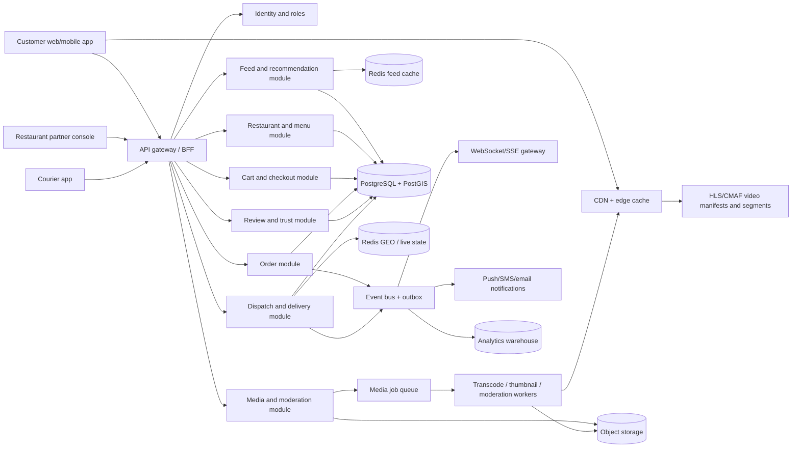

# Craveo technical architecture

## 1. Architectural position

Craveo is not one real-time system. It is the combination of three different workloads with different correctness and latency requirements:

| Workload | What must feel real-time | Recommended technology |
|---|---|---|
| Video discovery | Fast start, smooth vertical playback, fresh recommendations | Object storage, transcoding, HLS/CMAF manifests, CDN, feed cache |
| Food commerce | Accurate menus, inventory, prices, carts, payments, refunds | Transactional relational database, idempotent APIs, payment provider webhooks |
| Delivery operations | Order state, courier location, ETA, restaurant preparation state | Event bus, Redis state, WebSocket/SSE gateway, geospatial queries |

The best starting point for the current Craveo repository is a **modular monolith**: keep one Express codebase, but split it internally into modules with strict boundaries. This avoids premature microservices while allowing the video, order, and dispatch workloads to separate later. The existing Express/MongoDB/ImageKit application can be used as the prototype shell, but production ordering should move toward a relational transactional core, preferably PostgreSQL with PostGIS.

> **Important distinction:** Craveo reels are generally video-on-demand, not live streaming. A creator uploads a clip, the platform processes it, and viewers receive adaptive playback from a CDN. Delivery tracking and order state are genuinely real-time and should use events and WebSockets rather than database polling.

## 2. Proposed system topology



The edge layer serves video bytes and static thumbnails. The API layer owns authorization, discovery metadata, menus, carts, orders, reviews, and signed upload initiation. The application database stores metadata and transactional state, never large video bytes. The event bus distributes state changes to real-time clients, notifications, analytics, and operational tooling.

## 3. Video ingestion and playback

### Upload flow

A restaurant or customer requests an upload session from the API. The API authenticates the actor, validates role and file policy, creates a `media_assets` record with status `pending`, and returns a short-lived signed upload URL or provider upload token. The client uploads directly to object storage or the media provider. This prevents large video bytes from occupying an Express worker and avoids tying upload success to an HTTP request timeout.

After the upload completes, the client calls a finalize endpoint or the storage provider emits a webhook. The media module verifies the object, records its checksum and metadata, and publishes `media.uploaded`. Transcoding workers create multiple renditions, thumbnails, captions, a poster frame, and a playback manifest. A moderation worker checks policy, unsafe content, copyright signals, and food/relevance quality. Only an approved asset can become a public reel.

The current `storage.service.js` calls ImageKit directly from the backend. That is acceptable for the prototype and for image/video hosting if the provider supports the required adaptive playback workflow. At production scale, store the original object and immutable `storage_key`, `playback_manifest_url`, `poster_url`, and `duration_ms`; do not store video bytes in MongoDB or PostgreSQL.

### Playback flow

The feed API returns metadata and a playback manifest URL, not a large file URL. The client opens the manifest through the CDN and requests only the segments needed for the current viewport. The player should preload the next reel, pause off-screen reels, respect reduced-motion and data-saver settings, and record coarse watch events asynchronously.

Use short-lived signed playback URLs for private, pending, or region-restricted content. Public approved reels can use CDN caching with a stable cache key. Keep the origin storage private so an unmoderated or deleted asset cannot be fetched directly.

### Media states

`pending_upload -> uploaded -> processing -> moderation_pending -> published` is the successful path. Terminal and recoverable states should include `upload_failed`, `processing_failed`, `rejected`, `blocked`, `archived`, and `deleted`. Every state transition should be append-only in a media event log so support teams can explain what happened.

## 4. Commerce and delivery modules

### Discovery and feed

The feed service should combine hard filters with ranking. Hard filters include delivery radius, restaurant open state, item availability, dietary constraints, language, and moderation status. Ranking can use freshness, distance, watch completion, saves, order conversion, customer satisfaction, creator quality, and diversity rules. Do not let raw likes alone determine ranking because large restaurants and coordinated engagement can dominate the feed.

The first version can use PostgreSQL queries plus Redis caching. Later, emit behavioral events into a warehouse and train a ranking model offline. The feed response should include the reel, specific dish, restaurant, price, delivery estimate, source label, and conversion action in one payload.

### Menu, cart, and order

The menu module owns restaurant menus, item availability, modifiers, prices, taxes, and operating hours. The cart module creates a short-lived cart snapshot so a price or availability change cannot silently alter a checkout. At checkout, the order module revalidates the menu, calculates fees and taxes, reserves inventory where needed, creates an idempotency key, and authorizes payment.

The order state machine should be explicit:

`created -> payment_pending -> paid -> accepted -> preparing -> ready_for_pickup -> picked_up -> delivered`

with failure branches such as `payment_failed`, `rejected`, `cancelled`, `refunded`, and `delivery_failed`. Every transition should be validated by the backend and written to an order event table. Clients subscribe to events; they do not infer state from stale card data.

### Delivery tracking

A courier app sends location updates at a controlled interval, for example every 3–10 seconds while active and less frequently when stationary. A dispatch service stores the latest location in Redis GEO or a time-series location store and periodically persists sampled points for audit. The customer receives normalized events such as `courier_assigned`, `courier_near_restaurant`, `picked_up`, and `courier_near_dropoff`, rather than raw unfiltered GPS updates.

ETA should be calculated from restaurant preparation time, courier assignment, route distance, traffic provider data, and historical delivery durations. The customer-facing API should return an uncertainty window, not a false precision number.

## 5. Recommended database schema

The canonical transactional model below assumes PostgreSQL/PostGIS. The same boundaries can be implemented in MongoDB for the next prototype, but order payments, inventory reservations, and idempotent state transitions are easier to reason about with relational constraints and transactions.

### Identity and supply

```sql
users (
  id uuid primary key,
  role text not null check (role in ('customer', 'restaurant_owner', 'creator', 'courier', 'admin')),
  full_name text not null,
  email citext unique,
  phone text unique,
  avatar_url text,
  created_at timestamptz not null,
  updated_at timestamptz not null
)

restaurants (
  id uuid primary key,
  owner_user_id uuid not null references users(id),
  name text not null,
  slug text unique not null,
  description text,
  phone text,
  address jsonb not null,
  location geography(point, 4326) not null,
  status text not null check (status in ('draft', 'open', 'paused', 'closed', 'suspended')),
  price_band smallint,
  created_at timestamptz not null,
  updated_at timestamptz not null
)

restaurant_hours (
  restaurant_id uuid references restaurants(id),
  weekday smallint,
  opens_at time,
  closes_at time,
  primary key (restaurant_id, weekday, opens_at)
)
```

Recommended indexes are `restaurants(location)` using GiST, `restaurants(status, price_band)`, and a lower-case or trigram index for restaurant search.

### Menu and purchasable bites

```sql
menus (
  id uuid primary key,
  restaurant_id uuid not null references restaurants(id),
  name text not null,
  status text not null check (status in ('draft', 'published', 'archived')),
  version integer not null,
  published_at timestamptz
)

menu_items (
  id uuid primary key,
  menu_id uuid not null references menus(id),
  restaurant_id uuid not null references restaurants(id),
  name text not null,
  description text,
  image_url text,
  price_minor integer not null,
  currency char(3) not null default 'INR',
  is_vegetarian boolean,
  allergens text[],
  prep_time_seconds integer,
  is_available boolean not null default true,
  sort_order integer not null default 0,
  updated_at timestamptz not null
)

menu_item_options (
  id uuid primary key,
  menu_item_id uuid not null references menu_items(id),
  name text not null,
  required boolean not null default false
)

menu_item_option_values (
  id uuid primary key,
  option_id uuid not null references menu_item_options(id),
  name text not null,
  price_delta_minor integer not null default 0
)
```

`menu_items(restaurant_id, is_available)` should be indexed for live availability queries. Prices should be stored as integer minor units, never floating point.

### Media, reels, and trust

```sql
media_assets (
  id uuid primary key,
  owner_user_id uuid references users(id),
  restaurant_id uuid references restaurants(id),
  storage_key text not null unique,
  original_filename text,
  mime_type text not null,
  byte_size bigint not null,
  checksum text,
  duration_ms integer,
  width integer,
  height integer,
  poster_url text,
  playback_manifest_url text,
  processing_status text not null,
  moderation_status text not null,
  created_at timestamptz not null,
  published_at timestamptz
)

reels (
  id uuid primary key,
  media_asset_id uuid not null unique references media_assets(id),
  restaurant_id uuid not null references restaurants(id),
  menu_item_id uuid references menu_items(id),
  creator_user_id uuid references users(id),
  source_type text not null check (source_type in ('restaurant', 'customer', 'creator', 'editorial')),
  disclosure_label text not null,
  caption text,
  status text not null check (status in ('draft', 'published', 'archived', 'rejected')),
  published_at timestamptz,
  created_at timestamptz not null
)

reel_likes (
  reel_id uuid references reels(id),
  user_id uuid references users(id),
  created_at timestamptz not null,
  primary key (reel_id, user_id)
)

reel_saves (
  reel_id uuid references reels(id),
  user_id uuid references users(id),
  created_at timestamptz not null,
  primary key (reel_id, user_id)
)

reviews (
  id uuid primary key,
  restaurant_id uuid not null references restaurants(id),
  menu_item_id uuid references menu_items(id),
  reel_id uuid references reels(id),
  author_user_id uuid not null references users(id),
  order_id uuid references orders(id),
  rating smallint not null check (rating between 1 and 5),
  body text not null check (char_length(body) between 3 and 500),
  verified_purchase boolean not null default false,
  moderation_status text not null default 'visible',
  created_at timestamptz not null,
  updated_at timestamptz not null
)
```

For reviews, use a unique constraint such as `(author_user_id, order_id, menu_item_id)` when a verified order review is required. If the product allows general restaurant reviews, keep a separate constraint or review type rather than weakening the order-linked rule.

### Carts, orders, payments, and delivery

```sql
carts (
  id uuid primary key,
  user_id uuid not null references users(id),
  restaurant_id uuid not null references restaurants(id),
  status text not null check (status in ('active', 'checked_out', 'expired')),
  menu_version integer not null,
  expires_at timestamptz not null,
  created_at timestamptz not null,
  updated_at timestamptz not null
)

cart_items (
  id uuid primary key,
  cart_id uuid not null references carts(id),
  menu_item_id uuid not null references menu_items(id),
  item_snapshot jsonb not null,
  quantity integer not null check (quantity > 0),
  selected_options jsonb not null default '[]'
)

orders (
  id uuid primary key,
  order_number text unique not null,
  user_id uuid not null references users(id),
  restaurant_id uuid not null references restaurants(id),
  status text not null,
  payment_status text not null,
  currency char(3) not null default 'INR',
  subtotal_minor integer not null,
  delivery_fee_minor integer not null,
  tax_minor integer not null,
  discount_minor integer not null default 0,
  total_minor integer not null,
  delivery_address jsonb not null,
  idempotency_key text not null unique,
  created_at timestamptz not null,
  updated_at timestamptz not null
)

order_items (
  id uuid primary key,
  order_id uuid not null references orders(id),
  menu_item_id uuid references menu_items(id),
  name_snapshot text not null,
  price_minor integer not null,
  quantity integer not null,
  options_snapshot jsonb not null default '[]'
)

payments (
  id uuid primary key,
  order_id uuid not null unique references orders(id),
  provider text not null,
  provider_payment_id text unique,
  status text not null,
  amount_minor integer not null,
  raw_event jsonb,
  created_at timestamptz not null,
  updated_at timestamptz not null
)

deliveries (
  id uuid primary key,
  order_id uuid not null unique references orders(id),
  courier_user_id uuid references users(id),
  status text not null,
  pickup_location geography(point, 4326),
  dropoff_location geography(point, 4326),
  eta_start timestamptz,
  eta_end timestamptz,
  assigned_at timestamptz,
  picked_up_at timestamptz,
  delivered_at timestamptz
)

order_events (
  id bigserial primary key,
  order_id uuid not null references orders(id),
  event_type text not null,
  actor_user_id uuid references users(id),
  payload jsonb not null default '{}',
  created_at timestamptz not null
)
```

Use `orders(user_id, created_at desc)`, `orders(restaurant_id, status, created_at desc)`, `order_events(order_id, created_at)`, and `deliveries(status, courier_user_id)` indexes. Keep an immutable price and item snapshot inside `order_items` so historical orders remain correct after menu changes.

### Live locations and events

Do not put every courier GPS update into the primary order tables. Use a short-lived state store and sampled persistence:

```text
live_courier_state:{courierId}
  latitude
  longitude
  heading
  speed
  accuracy
  last_seen_at
  active_order_id
```

Use an `outbox_events` table in the transactional database. The order transaction inserts the order change and its outbox record atomically. A publisher reads the outbox and sends events to the message broker. This prevents the classic failure where the order commits but the WebSocket notification is lost.

## 6. API and real-time contracts

The API should be organized around domain commands rather than database tables:

| API | Purpose |
|---|---|
| `POST /media/upload-sessions` | Validate actor and create a signed media upload session |
| `POST /media/:id/finalize` | Confirm object upload and enqueue processing |
| `GET /feed?lat=&lng=&cursor=` | Return orderable, local reels with metadata |
| `GET /restaurants/:id` | Return restaurant identity, hours, menus, reels, and reviews |
| `POST /carts` and `PATCH /carts/:id/items` | Manage cart with server-side price validation |
| `POST /orders` | Create an idempotent order and authorize payment |
| `POST /orders/:id/cancel` | Apply cancellation rules and refund workflow |
| `POST /reels/:id/reviews` | Create or update a review, preferably linked to an order |
| `GET /orders/:id/events` | Fetch missed order events after reconnect |
| `GET /ws` or `GET /events` | WebSocket or SSE channel for live order state |

The real-time client should always reconnect with the last received event ID. On reconnect, it calls the missed-events endpoint before resuming the stream. This makes the experience resilient to mobile network changes.

Example order events:

```json
{
  "eventId": "evt_01J...",
  "type": "order.status_changed",
  "orderId": "ord_01J...",
  "status": "preparing",
  "occurredAt": "2026-08-24T12:30:00Z"
}
```

For reel analytics, use batched client events instead of a synchronous API request for every scroll. Record events such as `impression`, `view_2s`, `view_complete`, `restaurant_open`, `menu_item_open`, `add_to_cart`, `checkout_started`, and `order_completed`. Attach a session ID and attribution window so Craveo can measure whether video actually changes ordering behavior.

## 7. Security, moderation, and reliability

The upload endpoint must authorize the actor before issuing a signed upload session. Restrict MIME type, byte size, duration, resolution, and file extension; inspect the file signature server-side rather than trusting the browser MIME type. Use virus scanning and moderation before publication. Store only provider credentials on the server.

For the marketplace, use role-based access control for customers, restaurant owners, creators, couriers, and administrators. Every order mutation must verify ownership and current state. Payment webhooks must be signature-verified and idempotent. Every client retryable command should accept an idempotency key.

For reliability, make media jobs retryable, order events durable, and feed caches disposable. A Redis outage should slow recommendations, not lose orders. A CDN outage should degrade video playback, not prevent checkout. An analytics outage should never block a like, review, or payment.

## 8. Recommended rollout for Craveo

### Stage 1: prove visual commerce

Keep the current Express/MongoDB prototype, add a `restaurant` and `menu_item` reference to every reel, use the existing ImageKit storage boundary, and build a full-screen feed with a real restaurant page and add-to-cart action. Use a simulated or partner handoff for ordering if full delivery operations are not ready.

### Stage 2: build the transactional core

Introduce PostgreSQL for restaurants, menus, carts, orders, payments, and order events. Keep MongoDB only for legacy content if migration is not yet practical. Add an outbox publisher and a Redis cache. This is the point at which order correctness matters more than preserving the prototype database.

### Stage 3: operationalize media and delivery

Add asynchronous transcoding, moderation, adaptive playback, courier assignment, live location state, WebSocket updates, refunds, support tools, and restaurant analytics. Introduce a warehouse for attribution and recommendation experiments.

### Stage 4: build the defensible loop

Use verified customer reels, order-linked reviews, dish-level attribution, creator incentives, availability-aware ranking, and restaurant ROI dashboards. The defensible asset is not “a feed.” It is the network of local content, real-world food outcomes, trust signals, and transaction data.

## Final recommendation

For Craveo, the most practical production architecture is **a modular Express application backed by PostgreSQL/PostGIS for commerce, Redis for ephemeral feed and delivery state, object storage plus CDN for adaptive video, a durable event bus/outbox for real-time updates, and a separate analytics pipeline for recommendation and attribution**. Start as one deployable application, but keep media processing, ordering, and dispatch as separable modules from the beginning.
